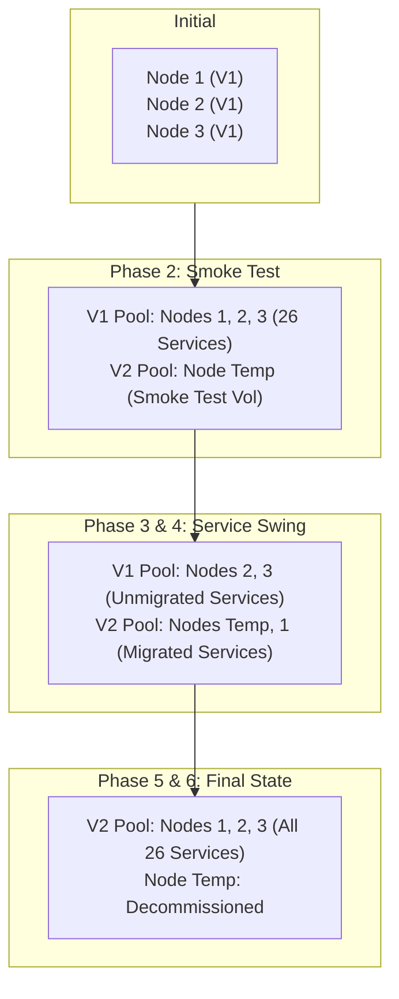

# Longhorn V2 Data Engine Migration Plan

## 1. Overview & Goal

This document defines the zero-downtime rolling migration plan for transitioning the storage subsystem of `home-cluster` from the **Longhorn V1 Data Engine** (Linux kernel iSCSI over filesystem directories) to the **Longhorn V2 Data Engine** (SPDK-based NVMe-oF TCP over raw block devices).

### Key Architectural Decisions

1. **Single-Disk Nodes via Talos `RawVolumeConfig`**:
   - Because each physical node has only a single 512GB NVMe SSD (`nvme0n1`), we avoid brittle loop devices by leveraging native Talos storage primitives:
     - `VolumeConfig` caps the `EPHEMERAL` partition (`/var`) at **60GiB**.
     - `RawVolumeConfig` provisions the remaining space (~450GB) as an unformatted partition labeled `r-longhorn-v2` (`/dev/disk/by-partlabel/r-longhorn-v2`).
2. **Longhorn 1.13.0 with Full Interrupt Mode**:
   - Longhorn 1.13.0 introduces event-driven **Full Interrupt Mode** (`dataEngineInterruptModeEnabled: '{"v2":"true"}'`), preventing SPDK reactors from continuously burning 100% of dedicated CPU cores at idle.
   - Longhorn 1.13.0 supports **Live Upgrades for V2 Instance Managers**, ensuring future Longhorn upgrades will not require volume detaches or app downtime.
3. **Swing-Node Migration (Zero Overall Downtime)**:
   - Cluster constraint: `numberOfReplicas: 2` with `replicaSoftAntiAffinity: false` requires 2 separate nodes per pool.
   - A temporary 4th node (**Node Temp**) is joined directly on V2.
   - Once Node 1 is reprovisioned to V2, **V1 runs on Nodes 2 & 3** and **V2 runs on Node Temp & Node 1**.
   - Services are migrated **one by one**, isolating downtime to 2–5 minutes per service while the remaining 25+ services stay 100% online.

---

## 2. Cluster Topology & Pool Progression



---

## 3. Migration Checklist

### Phase 1: Controller Upgrade to Longhorn 1.13.0

- [ ] Stage and verify Longhorn chart upgrade to `1.13.0` in `kubernetes/charts/core-services/longhorn/Chart.yaml`.
- [ ] Enable V2 data engine and interrupt mode in `kubernetes/charts/core-services/longhorn/values.yaml`:
  ```yaml
  longhorn:
    defaultSettings:
      v2DataEngine: true
      dataEngineInterruptModeEnabled: '{"v2":"true"}'
      guaranteedInstanceManagerCpuForV2DataEngine: 500 # mCPU
  ```
- [ ] Push to Git and allow ArgoCD to sync.
- [ ] Verify that all 26 V1 volumes remain attached, healthy, and functional.
- [ ] Verify `longhorn-manager` and CSI components rollout cleanly on Longhorn 1.13.0.

---

### Phase 2: Join Temporary Node & Smoke Test V2 Engine

- [x] Prepare `Node Temp` machine configuration using Talos `VolumeConfig` + `RawVolumeConfig` (60GiB EPHEMERAL, 202GiB raw partition).
- [x] Join `Node Temp` (`talos-ob8-ctw`, `192.168.5.144`) to the cluster as a **Worker** node.
- [x] Verify partition `/dev/disk/by-partlabel/r-longhorn-v2` (`/dev/vda7`) is present on `talos-ob8-ctw`.
- [x] In Longhorn, configure `node.longhorn.io/talos-ob8-ctw`:
  - Add disk `/dev/disk/by-partlabel/r-longhorn-v2` with `diskType: block` (`diskDriver: auto` -> `aio`).
  - Remove default filesystem disk `/var/lib/longhorn`.
- [x] **Run Smoke Test**:
  - Deployed test Volume, PV, and PVC with `dataEngine: "v2"`, `numberOfReplicas: 1`.
  - Spun up `smoke-test-v2-pod` on `talos-ob8-ctw`, wrote 50MB random data at 353.9 MB/s, and verified SHA256 checksum.
  - Verified SPDK instance manager health and low CPU usage in interrupt mode (`~27m CPU`).
  - Successfully detached and cleaned up smoke test resources.

---

### Phase 3: Transition Node 1 to Form 2-Node V2 Pool

- [x] Select `Node 1` (`talos-gcf-e16`, `192.168.5.11`) for conversion.
- [x] In Longhorn, enable **Eviction** on `Node 1`'s V1 disk (`/var/lib/longhorn`).
- [x] Wait for replica migration to complete. Confirm `Node 1` has **0 replicas** and all V1 volumes are `healthy` across `Node 2` (`192.168.5.12`) and `Node 3` (`192.168.5.13`).
- [x] Drain `Node 1` in Kubernetes.
- [x] Clean up old etcd member and node resource per `docs/TALOS.md`.
- [x] Update `talos/talconfig.yaml` to include `VolumeConfig` and `RawVolumeConfig` for `Node 1`.
- [x] Reset and reprovision `Node 1`.
- [x] Apply updated Talos config to `Node 1` and verify it rejoins Kubernetes and etcd.
- [x] In Longhorn, register `/dev/disk/by-partlabel/r-longhorn-v2` as `diskType: block`.
- [x] **Milestone Check**:
  - **V1 Pool**: Node 2 + Node 3 (2 nodes, 24 volumes healthy).
  - **V2 Pool**: Node Temp + Node 1 (2 nodes, hosting 2-replica V2 workloads).

---

### Phase 4: Service-by-Service Workload Migration

Migrate stateful applications one at a time. For each service:

1. Scale the service deployment / statefulset to `0`.
2. Take a final backup of the V1 volume to NFS (`storage.chimera-exponential.ts.net`).
3. Restore the backup as a new V2 volume:
   - Volume Name: `<app>-data-v2`
   - Data Engine: `v2`
   - Number of Replicas: `2` (Longhorn automatically places replicas on `Node Temp` and `Node 1`).
4. Update the app's `volume.yaml` in Git:
   - Update Volume, PV, and PVC names to `<app>-data-v2`.
   - Set `dataEngine: v2` in the Longhorn Volume spec.
5. Commit and sync via ArgoCD.
6. Scale up workload and verify application integrity.
7. Delete old V1 volume in Longhorn UI to reclaim disk space on Nodes 2 & 3.

#### Service Migration Tracking:

- [x] `pocketid` (Auth service)
- [x] `mail-proxy`
- [x] `pihole`
- [x] `mqtt`
- [x] `zigbee2mqtt`
- [ ] `home-assistant`
- [ ] `esphome`
- [ ] `sonarr`
- [ ] `radarr`
- [ ] `prowlarr`
- [ ] `sabnzbd`
- [ ] `qbittorrent`
- [ ] `seerr`
- [ ] `shelfmark`
- [ ] `audiobookshelf`
- [ ] `syncthing`
- [ ] `kavita`
- [ ] `plex`
- [ ] `jellyfin`
- [ ] `immich-model-cache`
- [ ] `uhf`
- [ ] Dynamic PVCs (CloudNativePG / Postgres databases)

---

### Phase 5: Reprovision Nodes 2 & 3 to V2

- [ ] Once all services are running on V2, confirm the V1 pool on Nodes 2 & 3 has **0 volumes**.
- [ ] **Reprovision Node 2** (`192.168.5.12`):
  - Drain node, remove etcd member, reset with partition wipe flags.
  - Apply Talos config with `VolumeConfig` + `RawVolumeConfig`.
  - Rejoin cluster, register `/dev/disk/by-partlabel/r-longhorn-v2` as `diskType: block`.
  - Confirm etcd quorum and node health.
- [ ] **Reprovision Node 3** (`192.168.5.13`):
  - Drain node, remove etcd member, reset with partition wipe flags.
  - Apply Talos config with `VolumeConfig` + `RawVolumeConfig`.
  - Rejoin cluster, register `/dev/disk/by-partlabel/r-longhorn-v2` as `diskType: block`.
  - Confirm etcd quorum and node health.
- [ ] Verify V2 pool now has 4 nodes (`Node Temp`, `Node 1`, `Node 2`, `Node 3`).

---

### Phase 6: Decommission Node Temp

- [ ] In Longhorn, enable **Eviction** on `Node Temp`'s block disk.
- [ ] Wait for Longhorn to rebalance all V2 replicas onto permanent Nodes 1, 2, and 3.
- [ ] Drain and remove `Node Temp` from Kubernetes:
  ```bash
  kubectl drain node-temp --ignore-daemonsets --delete-emptydir-data --force
  kubectl delete node node-temp
  ```
- [ ] Power down `Node Temp`.
- [ ] Verify that all 26 V2 volumes are `healthy`, replicated across Nodes 1, 2, and 3.
- [ ] Disable V1 data engine in Longhorn settings if no longer needed:
  ```yaml
  longhorn:
    defaultSettings:
      v1DataEngine: false
  ```
- [ ] Migration complete!
